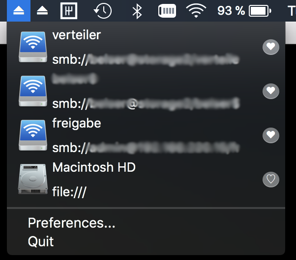

# MountView

A simple MenuBar application, that helps you keeping track of your favorite remote folders..
It does so by presenting a combined view of

* The currently mounted remote folders, that can be opened by clicking the menu item
* Your favorite folders, that can be mounted (and opened) by clicking the menu item

You can love / unlove these folders and eject them, if they are mounted.

  

## Usage

Initially you mount your share via Finder. Then click on the MountView Icon (⏏) and click on the love icon. Now the entry will show up even if the share is not mounted.

## TODO

- Import Recent Items (From Finder / Recent Items Menu)
- Autostart
- Custom Names of Mount Points

## Contributing

This was mainly done to learn swift and assist my workflow. If you like this project and know swift better than me, I'd love to see patches, that improve my coding style. I'd also love
- Testing
- Better Icons (at least an icon, right?)
- Features (See TODO for inspiration)

## Bugs

There are problems, when mounting shares with domains e.g. mydomain\myuser.

## License

This project is licensed under the MIT License - see the [LICENSE](LICENSE) file for details

## Acknowledgments

Heavily based on http://footle.org/MountView/
